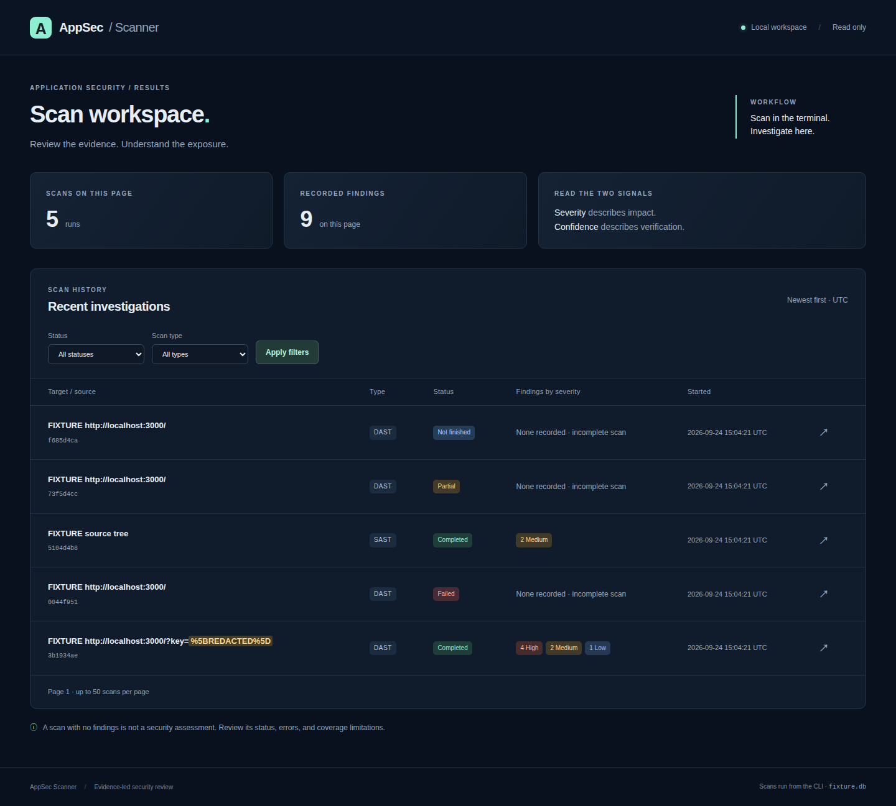

# AppSec Scanner

A local portfolio project that distinguishes confirmed vulnerabilities from
indicators requiring manual review. Python, requests, BeautifulSoup, optional
Playwright, SQLite and a read-only Flask dashboard. Built incrementally through
v0.1–v0.4; see [verification results](docs/verification.md) for commands and observed results.

[Architecture](docs/architecture.md) · [Data contract](docs/data-contract.md) ·
[Dashboard](docs/dashboard.md) · [Actual fixture sample](examples/sample-fixture-dast.json)



## Quick start

```sh
python3 -m venv .venv
. .venv/bin/activate
pip install -e '.[dev,browser]'
python -m playwright install --with-deps chromium
docker compose up -d juice-shop
appsec scan --config examples/juice-shop.json --output results/juice-shop.json
appsec scans
appsec export SCAN_ID --output results/export.json
appsec dashboard
```

Only scan systems you own or have approval to test. Every run requires an
explicit exact hostname allowlist. Subdomains are not implicitly approved.
`--static` discovers HTML links/forms; `--spa` renders pages and observes API
traffic; `--manual --endpoint 'http://127.0.0.1:3000/path?q=test'` targets explicit
GET inputs. POST form/JSON endpoints require config plus `--allow-post`.
POST requests can change application state. These modes share scope enforcement.

Exit codes: 0 completed, 1 invalid configuration/storage operation, 2 partial or
failed scan. A completed scan describes only the selected bounded checks; it
does not certify an application secure. Inspect errors and limitations.

Defaults: 20 pages, depth 3, 40 endpoints, 8 parameters per endpoint, 400 total
requests, 180-second scan budget, 5-second per-request timeout, 1 MB response
limit (the Juice Shop example allows 8 MB for SPA assets), 5 redirects, 500 ms SPA settle time. Budgets include verification and
authentication. No brute-force resource enumeration or data extraction.
The wall-clock budget is cooperative; see [architecture](docs/architecture.md).
`--max-response-bytes` can adjust body limits up to 20 MB. `--allow-post` gates
injected POST probes; SPA application scripts can make ordinary POST requests.

## Evidence and mappings

Severity estimates impact; confidence records proof. Reflection and database
errors alone are **suspected**. XSS becomes confirmed only after Playwright
observes an alert containing the probe's unpredictable identifier. GET query
execution is supported; POST reflection remains suspected. SQLi requires three
stable baseline/true/false/independent-control rounds, including reversed order;
dynamic responses conservatively remain unconfirmed. No timing-based claims.

Mappings explicitly use **OWASP Top 10:2021**, not a mixture of editions:
[A03 Injection](https://top10.owasp.org/2021/A03_2021-Injection/) for XSS, SQLi,
SQL construction and eval; [A01 Broken Access Control](https://top10.owasp.org/2021/A01_2021-Broken_Access_Control/)
for IDOR; [A07 Identification and Authentication Failures](https://top10.owasp.org/2021/A07_2021-Identification_and_Authentication_Failures/)
for suspected hardcoded credentials. Pattern findings are contextual mappings,
not claims that a complete OWASP category was assessed.

The [data contract](docs/data-contract.md) defines persistence and export.
Secrets are redacted before persistence, and response evidence is minimized.
Keep real credentials in environment variables or ignored `local/` files.

## Authentication and dashboard (v0.2)

```sh
# Set these interactively in your shell; don't commit actual values.
read -r -p 'Test account email: ' APPSEC_EMAIL; export APPSEC_EMAIL
read -r -s -p 'Test account password: ' APPSEC_PASSWORD; export APPSEC_PASSWORD
appsec scan --config examples/juice-shop.json --auth examples/auth-juice-shop.json
appsec --db results/appsec.db dashboard --port 5000
```

Open http://127.0.0.1:5000. The dashboard reads existing results and exports JSON;
scans remain CLI-driven. It uses SQLite read-only connections and has no scan
initiation or mutation routes. Use on loopback; it is not a multiuser hosted app.

Authentication accepts `cookies`, `bearer_token`, limited auth `headers`, and
origin-scoped `local_storage`. `${ENV_NAME}` values are resolved without logging
them. Automated `login` supports form or JSON, optional HTML CSRF field fetching,
and a JSON `token_path` with optional `token_cookie` and `local_storage_key`.
The Juice Shop example sets both because the inspected whoami route reads a
token cookie. Login requires a `verify` endpoint with explicit JSON field
or body-content assertions. HTTP 200 alone is insufficient. See example configs
and [component documentation](docs/dashboard.md). MFA, CAPTCHA and arbitrary
interactive SSO are not automated; supply an existing authorized test session.

Authenticated requests, SPA discovery and browser XSS verification share the
session. Credentials are confined to the exact target origin; cross-origin
redirects are blocked even when both hosts are approved. Browser HTTP uses the
scoped requests transport (with TLS verification), service workers/WebSockets
are blocked. This changes browser transport behavior; streaming, client TLS,
redirect-relative navigation and unusual cookie flows may differ from a normal
browser. Scope is a hostname policy, not a DNS pinning/network firewall policy.

## IDOR and DVWA (v0.3)

See [target setup and coverage](docs/targets.md) for the pinned DVWA 2.5 Docker
profile, database initialization, low-security settings and authenticated scan.

The IDOR check accepts exactly two isolated accounts with explicit verified
identities and an explicit list of resources. Each resource declares its owner,
other account, expected other-account outcome (`deny` or `allow`), JSON identity
fields and separate protected-content assertions. Owner access is checked first
in each of two rounds. The non-owner must retrieve matching resource identity
**and protected content** to confirm a denied access violation. Status alone,
login HTML, failed owner baselines and intentionally shared access do not confirm
IDOR. Read-only JSON GET resources only; no ID enumeration or write operations.
Assertions must identify private content according to the application's actual
policy; a public ID/name alone is insufficient.

Run the controlled fixture in one terminal with `python -m tests.fixtures.lab`.
In another, set the synthetic fixture values (these are not real credentials):

```sh
export FIXTURE_OWNER_SESSION=fixture-session-alice
export FIXTURE_OTHER_SESSION=fixture-session-bob
export FIXTURE_PRIVATE_VALUE=fixture-private-alice
appsec scan --config examples/idor-fixture.json --output results/idor.json
```

Copy the example to ignored `local/` for your own authorized API. Credentials
remain environment-backed; protected assertion values never appear in exports.

## Local source scanning (v0.4)

```sh
appsec source-scan /path/to/authorized/source --output results/source.json
appsec source-scan tests/fixtures/source --output results/source-fixture.json
appsec --db results/appsec.db dashboard
```

Python uses the standard-library AST; JavaScript uses lightweight lexical and
pattern checks. Rules flag constructed SQL strings, direct `eval` calls and
literal values assigned to secret-like names. Every result is **suspected** and
requires manual review. No taint/data-flow analysis, dependency audit, full
JavaScript syntax validation or exploitability proof is claimed. Indirect calls,
obfuscation, unusual syntax and cross-file flows can be missed; fixtures and
constant expressions may be false positives. Source is never imported/executed.

Locations are source-relative paths and one-based lines. Quoted source literals
are masked before evidence is stored, including multiline literals. Symlinks
are skipped; `.git`, `.venv`, `venv`, `node_modules`, build directories and Python
caches are excluded. Default bounds: 500 files, 1 MB/file, 10 MB total; CLI flags
can adjust them. Supported extensions: `.py`, `.js`, `.mjs`, `.cjs`. Parse/read
errors and reached limits produce failed/partial status. UTF-8 source only.

## Reproduce the portfolio demo

```sh
python -m examples.generate_samples
appsec --db results/fixture-demo.db dashboard
```

The generator starts an ephemeral loopback fixture, makes actual DAST/IDOR
requests, runs Chromium execution verification, scans the source fixtures, and
writes three clearly named JSON samples under `examples/`. It also leaves results
in `results/fixture-demo.db` for the dashboard. The checked-in samples demonstrate
four DAST findings (two confirmed, two suspected), one confirmed fixture IDOR
finding, and six suspected SAST findings. They are **not Juice Shop/DVWA results**.

## Development

```sh
pytest -q
ruff check appsec tests
docker compose --profile tools run --rm scanner
docker compose --profile tools up -d dashboard
```

Run the container scanner at least once before starting the container dashboard.
They share the named `results` volume; the dashboard mounts it read-only. Local
CLI runs use `results/appsec.db` instead. Container export:
`docker compose --profile tools run --rm scanner export SCAN_ID > results/export.json`.

Controlled test fixtures are deliberately vulnerable and bind loopback only.
Target findings are never inferred from fixture results. PortSwigger support is
a future direction beyond v0.4.
