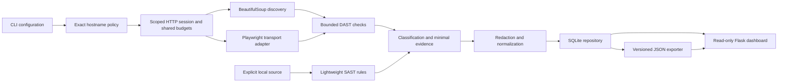

# Architecture and boundaries

`config.py` validates explicit scope and limits before discovery. `scope.py` is
shared by HTTP, auth and browser adapters. `http.py` disables ambient proxies
and netrc, checks each redirect hop, and binds credentials to the target origin.
One budget counts discovery, login, probes and verification requests.

Browser routing never delegates HTTP requests to uncontrolled Chromium network
following. It fulfills responses through the scoped HTTP client, preserving
MIME type and CSP. Service workers and WebSockets are disabled. This is a local
HTTP(S) application scanner, not an OS-level sandbox: use the deliberately
vulnerable labs locally, and apply a network firewall for broader hostile pages.
The hostname allowlist does not pin DNS addresses or restrict ports.

Discovery deduplicates by method, URL, input encoding and parameter names.
Different resource values therefore do not cause unlimited crawl expansion.
The first captured value set is retained. Repeated query keys, multipart bodies,
nested JSON mutation, arbitrary button clicking and JavaScript state exploration
are outside the current discovery model. Manually supply known API endpoints.

Checks return structured dictionaries rather than writing SQL. Persistence
normalizes, redacts and merges them by per-scan location/check identity. Confirmed
evidence cannot be downgraded by a later suspected probe. Stored data is the
single source for CLI exports and dashboard views; CL never writes SQL.

Budget timeouts are cooperative: the wall-clock budget is checked before each
request and request read timeouts apply to network inactivity. A response can
finish after the wall-clock deadline. Crawling, response sizes, redirect hops,
verification repeats and input counts have separate bounds. Interrupted process
results can remain `running`; they must not be interpreted as completed scans.
